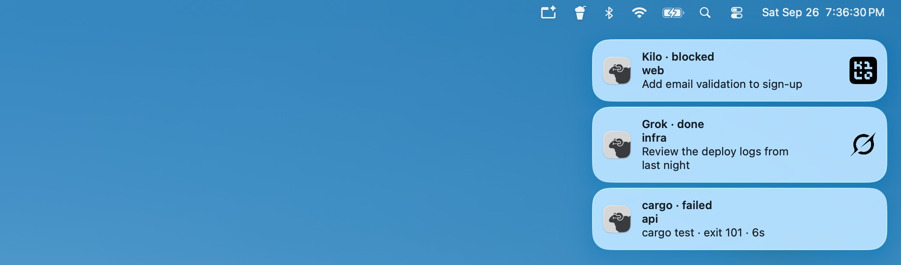
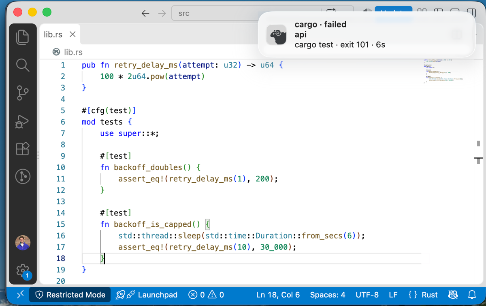
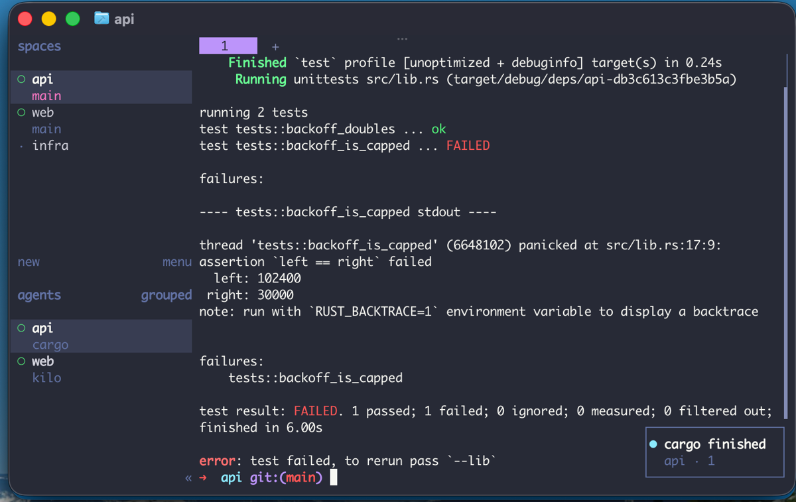

# Herdr Nudge

Mac notifications for [Herdr](https://herdr.dev). Know the moment an agent
needs you or a long command finishes, and click the notification to land on
that exact pane.



```sh
herdr plugin install justinchiasson/herdr-nudge
```

macOS only (Apple Silicon or Intel, tested on macOS 26), Herdr 0.9.0 or
later. Nothing else to install.

## What it does

- **Agents.** A notification when an agent goes `blocked` (it's waiting for
  you) or `done`, for the agents Herdr detects: Claude Code, Codex, Kilo,
  Grok and the rest. Most show their logo.
- **Long shell commands.** With the zsh hook, a notification when a command
  that ran 5 seconds or more finishes, with its exit status and how long it
  took.
- **Click to go back.** Herdr switches to the pane, in whichever workspace
  or tab it's in, and your terminal comes to the front.
- **Quiet when you're watching.** Nothing is posted for the pane you're
  looking at: focused in Herdr, with your terminal in front.
- **Cleans up after itself.** A notification goes away when its pane moves
  on (the agent starts working again, you run another command), or when the
  pane, its tab or its workspace closes. On Herdr 0.9.1 it also goes when
  you switch to the pane yourself.

| A test run fails while you're in your editor | Click the notification, and you're at the pane |
|---|---|
|  |  |

## Install

```sh
herdr plugin install justinchiasson/herdr-nudge
```

Herdr shows what the plugin will run and asks first. That's it: the next
time an agent needs you, you get a notification. The first one makes macOS
ask whether Herdr Nudge may send notifications. Allow it.

If macOS offers to install the Command Line Tools during the install, accept:
`herdr plugin install` uses `git`, which comes with them.

macOS shows a notification for a few seconds, then keeps it in Notification
Center, clickable for an hour. To keep them on screen until you deal with
them, set Herdr Nudge's alert style to *Persistent* in System Settings >
Notifications (*Alerts* on older macOS).

To update, run the install command again. To remove it, `herdr plugin
uninstall herdr-nudge` (and the `.zshrc` lines, if you added them).

## Shell commands (optional, zsh)

Herdr tells the plugin about agents by itself, but not about shell commands.
To get a notification when a long command finishes, add this to your
`~/.zshrc` (`$ZDOTDIR/.zshrc` if you set `ZDOTDIR`):

```zsh
if [[ -r ~/.local/state/herdr/plugins/herdr-nudge/herdr-nudge.zsh ]]; then
  source ~/.local/state/herdr/plugins/herdr-nudge/herdr-nudge.zsh
fi
```

Then restart Herdr once (`herdr server stop`, then `herdr`), so the plugin
writes the file those lines load. If you've moved Herdr's state directory
with `XDG_STATE_HOME`, `doctor` prints the right path for yours.

The hook does nothing outside a Herdr pane. Agents are left to report
themselves, whatever name you start them by, and so are the commands in
`[shell] ignore_commands` (editors, pagers, `ssh`, `tmux` and the like),
since those end when you quit them.

The notification shows the command line as you typed it, cut at 60
characters, so anything secret you put on a long-running command line ends
up in Notification Center.

## Commands

You don't need these day to day. They're for checking your setup and trying
things out. They aren't on your `PATH`, but this finds them from any shell,
and the path stays the same across updates:

```sh
nudge="$(herdr plugin list --plugin herdr-nudge --json | sed -n 's/.*"plugin_root":"\([^"]*\)".*/\1/p')/bin/herdr-nudge"
[ -x "$nudge" ] || echo "herdr-nudge isn't installed"
"$nudge" doctor
```

| Command | What it does |
|---|---|
| `doctor` | Checks what stops notifications: a config that doesn't load, `[agents] ignore` entries that match nothing, macOS permission and alert style, Herdr's own system toasts (which would double up), and whether `.zshrc` loads the hook. Exits 1 if something is broken. |
| `test` | Posts an agent-style notification for the pane it runs in. Switch away and click it to see where it takes you. `test --shell` posts a shell-command one. Run it inside a Herdr pane. |
| `example-config` | Writes `config.toml` with every setting at its default and a note on each. If the file already exists, it prints the example and leaves your file alone. |
| `setup-zsh` | Adds the zsh lines above to `.zshrc`, after showing them and asking. Does nothing if they're already there. |

The others (`--cleanup`, `--click`, and no arguments) are what Herdr and the
notifications run.

## Configuration

Settings live in `config.toml`, in the plugin's config directory:

```sh
herdr plugin config-dir herdr-nudge
```

You don't need the file at all. `example-config` writes it with every
setting at its default and a note on each. These are all of them:

| Key | Default | |
|---|---|---|
| `default_terminal` | unset | Bundle id of the app a click brings forward. Unset, it's the terminal your Herdr client runs in. It's a top-level key, so it goes above the first `[section]`. |
| `[notifications] clickable_secs` | `3600` | How long a notification can still be clicked in Notification Center, in seconds. |
| `[notifications] sound` | `false` | Herdr plays its own sound for these events. `true` adds ours. |
| `[notifications] agent_logos` | `true` | The agent's logo on the right of the notification. |
| `[notifications] show_workspace` | `true` | The workspace's name under the title. |
| `[agents] enabled` | `true` | Notifications for AI agents. |
| `[agents] statuses` | `["blocked", "done"]` | Agent states that notify. Any of `idle`, `working`, `blocked`, `done`. |
| `[agents] ignore` | `[]` | Agents to stay quiet about, by Herdr's label (`"codex"`, not `"Codex"`). |
| `[shell] enabled` | `true` | Notifications for shell commands. |
| `[shell] min_seconds` | `5` | How long a command runs before it counts. |
| `[shell] statuses` | `["idle", "done"]` | Shell states that notify. Herdr turns a finished command's `idle` into `done` when you weren't looking at the pane, so both are there. |
| `[shell] notify_on_failure_only` | `false` | Only failed commands. |
| `[shell] ignore_commands` | editors, pagers, `ssh`, `tmux` and more | Commands to stay quiet about, matched on the command name. A list you set replaces the default one. |
| `[shell] known_agents_extra` | `[]` | Labels to treat as AI agents, whatever Herdr says. Herdr's own agents need no entry. |
| `[shell] known_agents_remove` | `[]` | Labels to treat as shell commands, whatever Herdr says. |

A key the plugin doesn't know makes it ignore the whole file and use the
defaults until it's fixed. `doctor` and `herdr plugin log` say so. The
`[shell]` settings reach the zsh hook only after Herdr restarts.

## Known limits

- A `done` notification stays up if you come back to its pane by switching
  apps, with the pane already selected in Herdr. Herdr sends plugins no event
  for that. It goes when you click it, when the pane changes state again, or
  after an hour.
- A click brings your terminal app to the front. If you have several windows
  of it open, macOS brings forward the one you used last, which may not be
  the one running Herdr.
- If you move a pane to another workspace, a notification it already had
  doesn't clear by itself.

## Development

`cargo test` runs the tests. The manifest runs the committed universal binary
in `bin/`, so after changing the source, `tools/build-bin.sh` rebuilds it
(needs both Rust targets: `rustup target add x86_64-apple-darwin
aarch64-apple-darwin`), and it's committed with the change. After a Herdr
upgrade, see `tests/fixtures/README.md`.

## License

MIT. terminal-notifier is MIT too, and its licence is in
`vendor/terminal-notifier-LICENSE.md`.

The Herdr logo and the agent logos belong to their owners, and this plugin
isn't affiliated with any of them. `NOTICE.md` lists where each came from.
